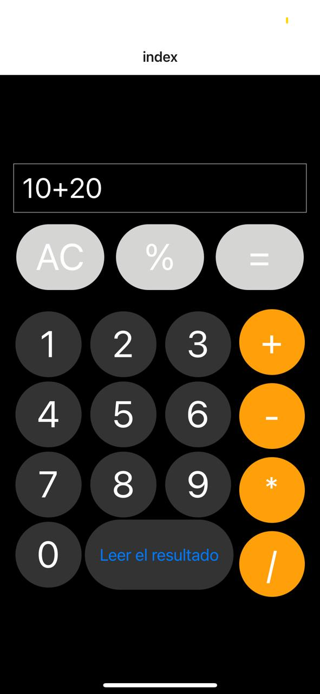

# Welcome to your Expo app 👋
Vista previa de la aplicacion



## Como iniciar
1. Clona el proyecto
  ```bash
  git clone https://github.com/angelcruz07/Calculadora-basica-expo.git
  ```

2. Instala las depenciencias

   ```bash
   npm install
   ```

3. Inicia la aplicacion

   ```bash
    npx expo start
   ```

